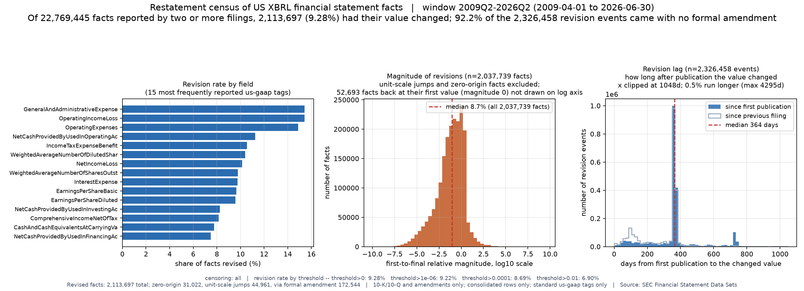
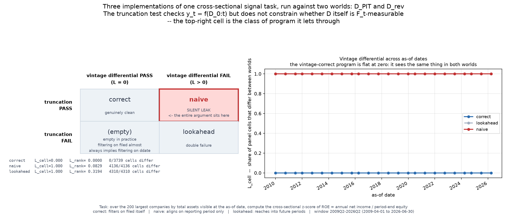

# sec-xbrl-pit

在完全公开的 SEC 数据上回答两个问题：

1. **美股财报数值被后续申报改写得有多普遍？** 改多大、隔多久、其中多少走了正式修正案。
2. **一个通过了截断检验的程序，是否仍可能在用它当时拿不到的数据？**

第二个问题是这个仓库存在的理由。截断检验检查的是「函数 f 对输入张量 D 是因果的」，
即 y_t = f(D_0:t)；它**不约束 D 本身是否 F_t-可测**。
修订改写的是过去而不是未来，所以用了修订后数据的程序能原样通过截断检验。

---

## 结果

窗口 **2009Q2–2026Q2，FSDS 共 69 个季度**。

```
80,960,707 行观测   |   41,769,440 个业务键
15,055 家公司       |   7,664 个标签   |   400,076 份申报
原始 ZIP 5.7GB → Parquet 1.0GB
```

### 重述普查

| | |
|---|---|
| 被两次以上申报报告过的事实（业务键） | 22,769,445 |
| 其中取值被改过 | 2,113,697（**9.28%**） |
| 相对变化超过 1% 的 | 6.90% |
| **2,326,458 个重述事件中未经正式修正案的占比** | **92.2%** |
| 重述滞后中位数（从首次发布算起） | **364 天** |
| 首末相对幅度中位数 | 9.3%（剔除单位量级跳变后 8.7%） |

三个数字值得单独看：

- **重述按披露日历到来。** 从一个数字首次发布算起，**65.7%** 的重述落在 300–399 天后——
  次年报告的可比列。年度数字在**两年处**还有第二个峰（其重述有 26.6% 落在 700–759 天），
  因为年报的利润表和现金流量表最多列三年。落在 60–129 天（下一份季报）的只有 5.9%。
  重述几乎不在随机时点发生，而是随着后来的定期报告一起到来。
  这个结构本身就解释了为什么「只监控 10-K/A」会漏掉九成以上。

  *量哪一种滞后很要紧。* 如果从「上一次报告该数字的申报」算起，滞后会在 100 天附近出现一个假峰：
  上年末余额会在其后三份 10-Q 里反复出现，次年 10-K 改它时，距上一份 10-Q 约 100 天，
  距它首次发布却已近一年。所以头条数字从首次发布算起。
  两种口径都保留（`lag_since_first_days`、`lag_days`），分箱占比见 `stats_lag_bins.csv`。
- **重述率要分两个口径看，两者相差两倍以上，混用会把结论讲反。**

  在**最常用的字段**里（按被报告次数取前 20），最高的是
  `GeneralAndAdministrativeExpense` 与 `OperatingIncomeLoss`，都在 **15.4%**；
  `OperatingExpenses` 14.9%，`GrossProfit` 14.3%，`EarningsPerShareBasic` 9.7%、`EarningsPerShareDiluted` 9.6%。
  也就是说**每六个营业利润数字里就有一个后来被改过**。

  在**全部字段**里（被多次报告的事实不少于 1000 个），最高的是终止经营与房地产类科目：
  `DiscontinuedOperationIncomeLoss…` **42.1%**、`RealEstateRevenueNet` 33.1%、
  `IncomeLossFromContinuingOperations…` 32.2%。
  这有明确的机制解释——一个分部被终止时，所有过往期间都要重述把它挪到线下。

  两个口径分别落盘为 `stats_rate_by_tag.csv` 与 `stats_rate_by_tag_highest.csv`。
- **尾部很长**：从首次发布算起 p99 是 881 天，最长一条隔了 **4,295 天**（近 12 年）才被改写。



### vintage 微分演示

同一个截面信号任务的三个实现（第四个 `restated` 由 `scripts/restatement_control.py` 运行，见下文），跑在两个世界上：

```
world_pit(t) = 观测表中 filed <= t 的子集      D_PIT
world_rev    = 观测表全部                      D_rev
```

| 程序 | 期末日对齐 | 受理日对齐 | 截断检验 | Λ_cell | Λ_rank | 判定 |
|---|---|---|---|---|---|---|
| `correct` | `ddate <= t` | `filed <= t` | 通过 | **0.000** | 0.0000 | clean |
| `restated`† | `ddate <= t` | `filed <= t`（仅用于选期，取值取最新版本） | **通过** | 0.952 | 0.0070 | **silent_leak** |
| `naive` | `ddate <= t` | 无 | **通过** | **1.000** | 0.0829 | **silent_leak** |
| `lookahead` | `ddate <= t+1y` | 无 | 失败 | 1.000 | 0.3194 | double_failure |

† `restated` 由 `scripts/restatement_control.py` 运行，不在 `secpit.cli demo` 里。

`naive` 的错法是真实的：**按报告期对齐而不按公告日对齐**。
它同样不读取 `ddate > t` 的事实，所以**通过了截断检验**——这正是要演示的那一格。

`lookahead` 存在的唯一目的是证明截断检验不是空转的。没有一个会失败的对照，
「correct 与 naive 都通过了截断检验」这句话无法排除「截断检验根本没在工作」。

**两条通道，分开测。** `naive` 的泄漏有两条截断检验都看不见的通道：在季度末它读到了
该季度尚未申报的数字（发布滞后），并且每个数字都读的是最新修订版（重述）。
`scripts/restatement_control.py` 把两者分开：程序 `restated` 与 `correct` 完全一样地
选期，但取值取最新版本，于是只剩重述一条通道——它通过截断检验，Λ_rank = 0.0070
（Λ_cell = 0.952），把每个事实冻结在首次申报值之后两者都精确归零。同一个无修订对照下
`naive` 的 Λ_rank 仍有 0.0715（原为 0.0829）：as-of 日期取在季度末时，它的泄漏大部分来自发布滞后。
这取决于 as-of 日期的位置：季度末那天当季的报告一份都还没申报，滞后通道最宽；
把全部 as-of 日期往后挪 60 天，`naive` 降到 0.0308，其中无修订对照保留 0.0178，
而 `restated` 升到 0.0128——两条通道量级相当。脚本两组都输出。



一个顺带得到的经验规律：**按 `filed` 过滤在实践中蕴含了按 `ddate` 过滤**——
一个期间几乎不可能在结束前被申报（三个演示字段的 347 万行里只有 275 行期末晚于申报日）。
因此自行按 `filed` 过滤的程序在实践中都会通过截断检验，
本任务的程序没有一个落在「截断失败但版本微分通过」那一格。

每个程序落在 2×2 表的哪一格，是由程序怎么写决定的，不是实验「发现」的：截断按 `ddate` 施加，
`naive` 本来就不读 `ddate > t` 的行，所以必然通过；`correct` 自己按 `filed <= t` 过滤，
在两个世界里看到的行完全相同，Λ = 0 是构造使然。这个演示是存在性证明，把结构性论断
变成可运行的代码；它的经验内容在 Λ 的大小，以及两条通道的拆分。

---

## 复现

```
export SECPIT_USER_AGENT="Your Name you@example.com"   # SEC 要求请求头声明联系方式
python3 -m secpit.cli build     # 下载 69 个季度 + 解析 + 主键断言（5.7GB，约 20 分钟）
python3 -m secpit.cli census    # 事件检出 + 普查 + 统计（约 3.5 分钟）
python3 -m secpit.cli renames   # 推导 taxonomy 改名等价类并对比修正前后
python3 -m secpit.cli crosscheck  # 用 Company Facts 抽样校验（200 家公司，seed=0）
python3 -m secpit.cli demo      # 两个世界 × 三个程序 × 两个检验（约 40 秒）
python3 -m secpit.cli figure    # 两张图
python3 -m pytest tests/ -q     # 48 个单元测试
python3 scripts/kraft_heinz_case.py   # 已知案例的独立数据源核对
python3 scripts/restatement_control.py   # 发布滞后与重述分开测
```

在 17GB 内存的机器上实测峰值：`build` 3.30 GB、`census` 3.42 GB、
`demo` 1.37 GB、`figure` 0.31 GB。

---

## 口径与已知限制

**可见性用 `filed`（日粒度受理日），这是偏乐观的近似。**
400,076 份申报中 56.8% 受理于 16:00 之后；其中 33,707 份被 EDGAR 顺延至次日
（这批的 `filed` 已是次日，不受影响），但仍有 **48.4% 是收盘后受理而 `filed` 标当天的**，
它们在盘中实际不可得却被算作当天可见。带时分秒的 `accepted` 列一并保留在观测表中，
供改用更严格口径。

**两侧截断的影响都很小，而且都把重述率往下压。**
四组口径分别为：全体 9.283% / 剔右 9.339% / 剔左 9.337% / 两者都剔 9.393%。
首次观测不是原始申报的键记为左截断，来源有二：首次观测落在窗口第一个季度（1,315 个键）；
或者这个数第一次出现就在比较列里，它所属期间的原始申报不在库中（1,483,697 个键，占分母 6.5%）。
后者来自 XBRL 在 2009–2011 年的分批强制、IPO、由 20-F 转报 10-K、改用标准标签等。
只看前一个来源，左截断会显得可以忽略。
这批键的重述率是 8.51%，低于其余的键——丢了原始申报，第一次改动就看不到——
所以头条 9.28% 是偏保守的数。

**重述率随所覆盖的时期变化。** 用同样方法构造的三个 12 季度窗口，重述率分别是
9.06%（2014Q3–2017Q2）、7.42%（2018Q3–2021Q2）和 5.93%（2023Q3–2026Q2）。
三个窗口长度相同、截断结构相同，差别来自时期，而不是窗口长短：
只用近年申报搭建的评测，看到的重述会比完整历史所显示的少。
每个窗口都在独立目录里由同一批 ZIP 重建（`--root` 指向一个 `data/raw` 链到已下载 ZIP 的目录，
`--quarters` 列出 12 个季度），依次运行 `build` 与 `census`。

**这些数字是关于 FSDS 数据集的陈述，不是关于原始申报的陈述——
但 SEC 的另一条编纂管线现在给这件事定了界。**
SEC 自己的免责声明写着它无法保证数据集的准确性、抽取编译过程可能引入误差，
所以单凭 FSDS 无法区分「真实重述」与「抽取误差」。
以 Company Facts 这个独立维护的 SEC 端点做抽样校验：

| | |
|---|---|
| 抽样公司数（seed=0，可复现） | 200 |
| 两个来源都有的观测 | 811,097（占我方 93.9%） |
| **匹配观测上的取值一致率** | **99.999%**（冲突 5 条） |
| 5 条冲突 | 4 条是利率四位小数的舍入；1 条相差 3.1% |

200 家随机公司、81 万条观测，使「大到会影响普查结论」的系统性抽取误差不大可能存在；但抽样只覆盖 15,055 家公司中的 200 家（1.33%）。
未匹配的 6.1% 不是分歧，而是 Company Facts 在同一归一化键下没有对应行。
两个来源都由 SEC 从同一批 XBRL 申报编纂而来，所以一致只能排除数据集编纂环节引入的误差，
排除不了申报人自己打标签时的错误。

`scripts/kraft_heinz_case.py` 保留为聚焦单案例的演示。

**Λ_cell 在本任务上会饱和。** 信号做了截面 z-score，任何一家公司的输入被改
都会通过均值与标准差污染整个截面，所以 `naive` 的 Λ_cell 恰为 1.000。
Λ_rank 才是这里的分级量度（`naive` 0.083，`lookahead` 0.319）。

**数据本身的六个坑**，逐条显式处理：
分部与维度拆分行、自定义标签、单位跃迁、空值、首值为 0、以及**同一份申报内部自相矛盾**
（全量 8100 万行中有 26 行同一事实被报了两个不同的值，已整组丢弃并计数）。

**taxonomy 改名已量化修正，偏差远小于预期。**
业务键含 `tag`，概念被改名后旧键停止、新键开始，跨改名的重述会被漏掉。
`secpit/renames.py` 从数据本身推导等价类——判别式是「真改名在同一个
(cik, ddate, qtrs, uom) 上取值大量精确相同」，在用于标定的已知案例上，真改名 35–92% 一致、
巧合的后继者约 0.1%，分离得很干净（最终采纳的 27 对介于 41%–98%）。修正后 **9.2830% → 9.3103%，相对仅 +0.29%**。
合并标签本身也有坑：一份申报同时报了旧标签与新标签时，合并后同一个键下有两行，
两者之差会被算成一次 0 天的重述。这类情况按「同一份申报自相矛盾」的同一条规则处理：
取值相同的留一行，取值矛盾的整组丢弃并计数（32,973 组）。

**其他边界**：仅 10-K / 10-Q 及其修正案；仅合并口径行（丢弃约 47% 的分部与维度拆分行）；
仅 us-gaap 标准标签。

**数据源选 FSDS 而非 Company Facts**，理由是可复现：FSDS 季度 ZIP 发布后固定，
Company Facts 是随时重建的实时快照，同一份代码今天与三个月后跑出来的东西不一样。

---

## 结构

```
secpit/
  config.py      常量与路径，全部魔数的唯一出处
  fetch.py       下载 SEC 季度 ZIP，清单驱动跳过，原子改名
  parse.py       表头断言、五条件过滤与计数守恒、两级分区落盘
  store.py       主键断言（逐年份分区）、as_of / latest / diff_worlds
  revisions.py   重述事件检出与普查，按 cik 桶分区、结果落盘再合并
  stats.py       十二张统计表，多数分四组截断口径
  renames.py     从数据推导 taxonomy 改名等价类
  crosscheck.py  用 Company Facts 抽样校验
  demo.py        数据句柄（含陷阱接口）、三个程序、截断检验、Λ
  figures.py     图一普查、图二 Λ 演示
  cli.py         build / census / renames / crosscheck / demo / figure
scripts/
  kraft_heinz_case.py    已知案例的独立来源核对
  restatement_control.py 发布滞后与重述两条通道分开测
figures/                 两张图（交付物，入版本库）
data/
  raw/  parquet/  out/   （中间产物不入版本库，由 CLI 重建）
tests/                   48 个单元测试
```

观测表按 `filed_year=YYYY / cik_bucket=B` 两级分区。
两个分区键各自服务一类访问：`filed_year` 让主键断言与受理时刻统计可以逐年独立进行
（一份 filing 只在一个季度受理）；`cik_bucket` 让重述检出的分区过滤成为真正的分区裁剪。

## 环境

miniconda base，Python 3.13。polars 1.40、pandas 3.0、numpy、matplotlib 3.11、
requests、tqdm。测试期另需 pytest。不使用 pyarrow、scipy、DuckDB。

## 数据来源与合规

数据来自 [SEC Financial Statement Data Sets](https://www.sec.gov/data-research/sec-markets-data/financial-statement-data-sets)，
美国联邦政府作品，在美国不受版权保护。

按 SEC 的 [EDGAR 访问规范](https://www.sec.gov/search-filings/edgar-search-assistance/accessing-edgar-data)，
所有请求携带含联系邮箱的 User-Agent，速率远低于其 10 requests/second 的上限。
原始 ZIP 不入版本库。

> DISCLAIMER（SEC 原文）：数据集派生自各申报人提交的结构化数据，SEC 不保证其准确性；
> 抽取与编译过程可能引入误差；数据集不能替代申报文件本身。
